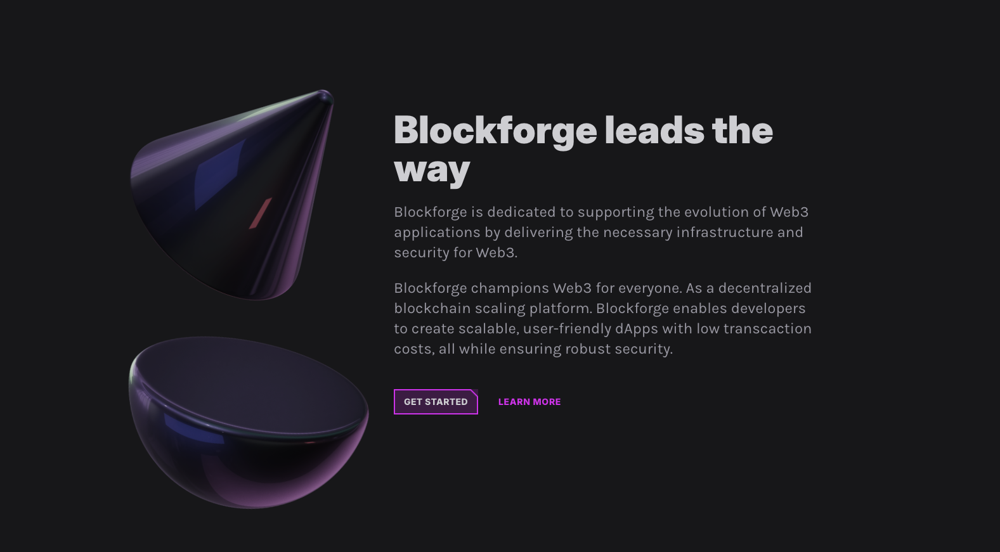

## Dark Sass Blockchain Site Template

This is a website created using AstroJS, TailwindCSS, and Framer Motion. It has multiple animations
throughtout the site. It's finally deployed to Netlify.

# BUILD WITH

- HTML
- AstroJS
- Tailwind CSS
- Framer Motion

# Live Version

[Live Site](https://cosmic-praline-027c3b.netlify.app/)

# AUTHOR

- Github: [@mariosknl](https://github.com/mariosknl)
- Twitter: [@mariosknl](https://x.com/MariosKnl)
- Linkedln: [marios-kanellopoulos](https://www.linkedin.com/in/marios-kanellopoulos)
- Portfolio: [marios-kanellopoulos](https://marioskanellopoulos.com/)

# Show your support

Give ⭐️ if you like this project!

# Acknowledgments

Frontend Tribe

### 🤝 Contributing

Contributions, issues, and feature requests are welcome!
Feel free to check the issues page.
